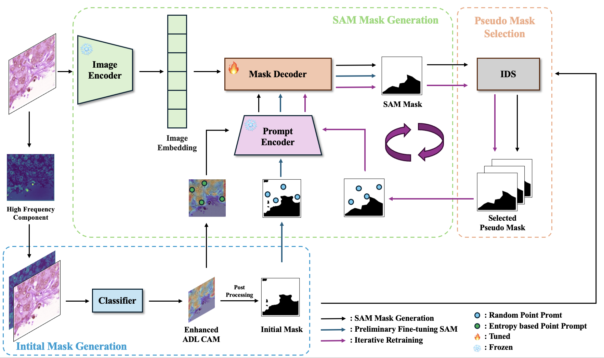

# EP-SAM: Weakly Supervised Histopathology Segmentation via Enhanced Prompt with Segment Anything

Joonhyeon Song, Seohwan Yun, Seongho Yoon, Joohyeok Kim, Sangmin Lee by Kwangwoon University and QI LAB. 

<a href='https://arxiv.org/abs/2410.13621'></a> 

## Abstract 

> This work proposes a novel approach beyond supervised learning for effective pathological image analysis, addressing the challenge of limited robust labeled data. Pathological diagnosis of diseases like cancer has conventionally relied on the evaluation of morphological features by physicians and pathologists. However, recent advancements in compute-aided diagnosis (CAD) systems are gaining significant attention as diagnostic support tools. Although the advancement of deep learning has improved CAD significantly, segmentation models typically require large pixel-level annotated dataset, and such labeling is expensive. Existing studies not based on supervised approaches still struggle with limited generalization, and no practical approach has emerged yet. To address this issue, we present a weakly supervised semantic segmentation (WSSS) model by combining class activation map and Segment Anything Model (SAM)-based pseudo-labeling. For effective pretraining, we adopt the SAM—a foundation model that is pretrained on large datasets and operates in zero-shot configurations using only coarse prompts. The proposed approach utilizes explicit visual prompting to transfer enhanced Attention Dropout Layer's knowledge to SAM, thereby generating pseudo-labels. To demonstrate the superiority of the proposed method, experimental studies are conducted on histopathological breast cancer datasets. The proposed method outperformed other State-of-the-Art (SOTA) WSSS methods across three datasets, demonstrating its efficiency by achieving this with only 12GB of GPU memory during training.

## Overview
 


The proposed approach transfer enhanced Attention Dropout Layer's knowledge to Segment Anything, thereby generating pseudo-labels.

## Environment

The following describes our experimental setup.

- Ubuntu 22.04.4 LTS
- 8x Intel(R) Xeon(R) Silver 4112 CPU @ 2.60GHz
- 1x NVIDIA TITAN Xp , 12GB

Execute the following cell to set up a virtual environment for running the code.

```bash 
# create a virtual env and activate
conda create -n EPLC_SAM python=3.10
conda activate EPLC_SAM 

# download packages
pip install -r requirements.txt 
```

Additional package is required to extract patches from WSI. Install the following package to run the code:

- [ASAP](https://github.com/computationalpathologygroup/ASAP) 1.8 (1.9 does not support the Philips scanner TIFF file format of the Center_4)
  - Download and install ```ASAP-1.8-python36-Linux.deb```. This will install ```multiresolutionimageinterface.py``` file to ```/opt/ASAP/bin```.

## How to Use 

### Train

- Move to ```code/``` directory

- Move downloaded datasets to ```dataset/camelyon16``` or ```dataset/camelyon17``` according to their respective dataset types
  - For the dataset structure required for model training, please refer to this [guide](code/dataset/README.md)

- Modify the ```DATASET_TYPE``` in ```train.sh``` file to match your downloaded dataset

- Run ```./train.sh```. This will perform everything from patch extraction to model training. Training logs will be saved in ```logging_{DATASET_TYPE}.txt```

- Model weights will be saved in ```code/checkpoints```

### Inference 

- Move to ```code/``` directory

- Configure the inference settings in ```infer.sh```
  - Set ```TEST_DATASET_DIR``` to your target dataset path
  - Set model weight paths (```RESNET_CHECKPOINT``` for the ResNet model,
```SAM_DECODER_CHECKPOINT``` for the SAM decoder)

- Run ```./infer.sh```. Inference results will be logged to ```logging_inference.txt```.


## Dataset

We utilized open public breast cancer WSI datasets: **Camelyon16** & **Camelyon17**. 

Find detailed dataset descriptions in the links below. For download instructions and other details, see [here](code/dataset/README.md).

### Camelyon16

- [Dataset link](https://camelyon16.grand-challenge.org/)

### Camelyon17

- [Dataset link](https://camelyon17.grand-challenge.org/)


### Contact

- Email: thdwnsgus0706@gmail.com
